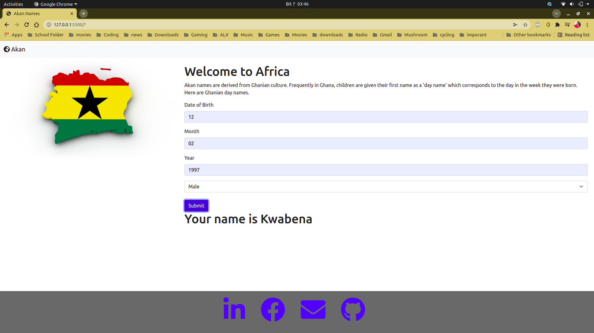

# Portfolio Website
This a is the second IP at Moringa School consisting of a web application that takes a user's birthday and calculates the day of the week they were born and then depending on their gender outputs their Akan Name. 

## Technologies Used
- HTML & CSS (Bootstrap)
- FontAwesome Icons

##### Requirements
Internet connection
##### Setup Instructions and Installation
N/A
## Known Bugs
none
##### Link to Live Site : 
[here]
### License
MIT Licence